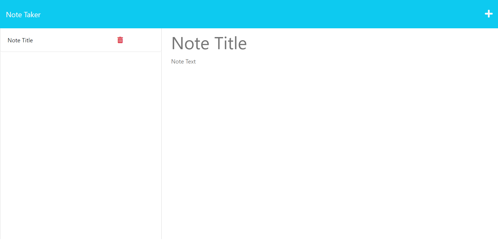

# NoteTakerApplication

## Project Description 

This project involved modifying starter code to create an application called Note Taker that can be used to write and save notes. This application will use an Express.js back end and will save and retrieve note data from a JSON file.

Below is a summary of the changes/additions that have been made to the original starter code.

* A `db.json` file added to the back-end to store and retrive notes using the `fs` module.

* `GET /notes`  returns the `notes.html` file.

* `GET *` returns the `index.html` file.

The following API routes were created:

* `GET /routes/notes` reads the `db.json` file and returns all saved notes as JSON.

* `POST /routes/notes` receives a new note to save on the request body, adds it to the `db.json` file, and then returns the new note to the client. 

* Each note is given a unique id when it's saved.

* Upon click of the save button, the note is saved into the local storage. 

* Upon refresh, the saved events persist. 

* `DELETE /routes/notes/:id` receives a query parameter that contains the id of a note to delete. 

# Usage

1. In order to run the application, click on the deployed application link.

2. Once you have been redirected to the web-page, to add a title, click in the text area for 'note-title'. To add your information click in the text-area for 'note-text' Click save for the task to be saved in local storage. Delete a task by clicking the bin beside the saved note.

# Website Preview

# Links
[Click here to access the deployed website.](https://note-takerapplication-d7df41159d31.herokuapp.com/)

[Click here to access the files on the github repository.](https://github.com/fadumaabdi/NoteTakerApplication)

